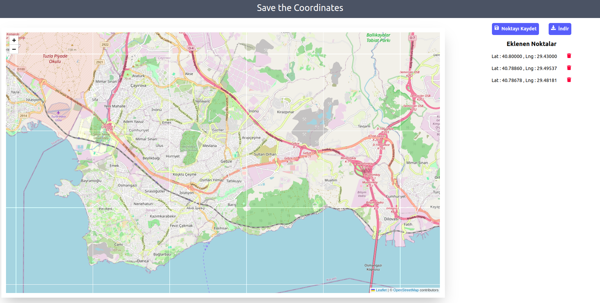

# React + TypeScript + Vite + Tailwindcss + Redux TKQ + NodeJS Responsive Leaflet App



## Table of Contents

- [Features](#features)
- [Installation](#installation)
- [Run the Application](#run-the-application)

### Features

<a name="features"></a>

- Responsive layout for mobile and desktop.
- Built with (React,Redux ,TypeScript.js, Tailwindcss, NodeJS)
- Uses Leaflet Map for the map.

### Installation

<a name="installation"></a> 3. Install Dependencies:

```bash
npm install
cd frontend
npm install
```

### Run the Application

<a name="run-the-application"></a>

```bash

# Run frontend (:3000) & backend (:5000)
npm run dev

```

```bash

# Run backend only
npm run server

```

5. BUILD & DEPLOY

```bash
# Create frontend prod build

npm run build
```
